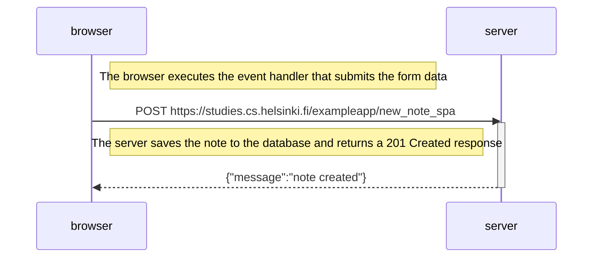

```mermaid

sequenceDiagram
  participant browser
  participant server

  Note right of browser: The browser executes the event handler that submits the form data

  browser->>server: POST https://studies.cs.helsinki.fi/exampleapp/new_note_spa
  activate server

  Note left of server: The server saves the note to the database and returns a 201 Created response
  
  server-->>browser: {"message":"note created"}
  deactivate server
```